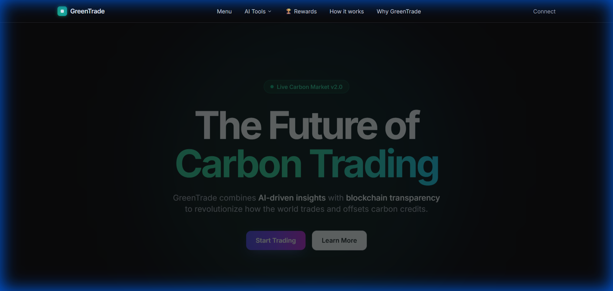

# 🌍 GreenTrade: AI-Powered Carbon Marketplace

<div align="center">
  
  <br />
  <br />

  [](https://nextjs.org/)
  [](https://www.typescriptlang.org/)
  [](https://thirdweb.com/)
  [](https://supabase.com/)
  [](https://deepmind.google/technologies/gemini/)

  <h3>Democratizing Sustainability with AI & Blockchain</h3>
  <p>Track. Trade. Offset. Verify.</p>

  [**View Screenshot**](#-project-screenshot) • [**Features**](#-key-features) • [**Tech Stack**](#-tech-stack) • [**Getting Started**](#-getting-started)
</div>

---

## 📖 Overview

**GreenTrade** is a decentralized platform that bridges the gap between individual action and global climate goals. By combining **Generative AI** for precision auditing and **Blockchain** for transparent trading, we solve the biggest challenges in the voluntary carbon market: accessibility, trust, and verification.

Users can calculate their footprint using AI, buy verified credits using Crypto or Fiat, and even mint new credits by providing satellite-verified proof of green projects.

---

## 📸 Project Screenshot



> *The GreenTrade Dashboard featuring AI Calculators, Carbon Marketplace, and Impact Tracking.*

---

## ✨ Key Features

### 🛒 Verified Carbon Marketplace
*   **Dual-Currency Trading:** Seamlessly buy credits using **ETH (Crypto)** or **INR (UPI/Cards via Razorpay)**.
*   **Real-Time Order Book:** Live buy/sell orders with professional trading charts and market depth.
*   **Portfolio Management:** Track your assets, view transaction history, and retire credits permanently on-chain.

### 🤖 AI-Powered Sustainability Tools
*   **Carbon Calculator:** powered by **Google Gemini**. Input your business details, and our AI generates a comprehensive audit report with ISO-compliant emission estimates.
*   **Plastic Footprint Tracker:** Analyze plastic usage patterns and get tailored reduction strategies.
*   **Smart Chat:** Ask "GreenTrade AI" anything about sustainability, regulations, or eco-tips.

### 🛰️ Satellite Verification & Auditing
*   **Time-Lapse Proof:** Minting credits requires uploading "Before" and "After" satellite imagery.
*   **Geo-Spatial Analysis:** Our system verifies GPS coordinates and green cover growth to prevent fraud *before* credits are minted.

### 🏆 Gamified Impact
*   **EcoPoints:** Earn points for every audit, trade, or offset.
*   **NFT Badges:** Unlock "Carbon Neutral", "Forest Guardian", and other on-chain achievement badges.
*   **Leaderboard:** Compete globally to become the top sustainability champion.

---

## 🛠 Tech Stack

| Component | Technology |
| :--- | :--- |
| **Frontend** | Next.js 14 (App Router), React, TypeScript, Tailwind CSS, Framer Motion |
| **Blockchain** | Thirdweb SDK, Ethereum (Sepolia/Polygon), Solidity Contracts |
| **Artificial Intelligence** | Google Gemini Generative AI (API) |
| **Backend & Storage** | Supabase (PostgreSQL), Next.js API Routes |
| **Payments** | Razorpay (Fiat), Ether.js (Crypto) |

---

## 🚀 Getting Started

### Prerequisites
*   Node.js 18+ installed
*   A Wallet (Metamask/Rabby) or a Social Login (Google/Email)
*   API Keys for Gemini, Thirdweb, and Supabase

### Installation

1.  **Clone the repository**
    ```bash
    git clone https://github.com/ShreyasDambalkar/GreenTrade.git
    cd GreenTrade
    ```

2.  **Install dependencies**
    ```bash
    npm install
    # or
    yarn install
    ```

3.  **Configure Environment Variables**
    Create a `.env.local` file in the root directory:
    ```env
    # Blockchain
    NEXT_PUBLIC_THIRDWEB_CLIENT_ID=your_client_id
    THIRDWEB_SECRET_KEY=your_secret_key

    # Database
    NEXT_PUBLIC_SUPABASE_URL=your_supabase_url
    NEXT_PUBLIC_SUPABASE_ANON_KEY=your_supabase_key

    # AI
    GEMINI_API_KEY=your_google_gemini_key

    # Payments
    RAZORPAY_KEY_ID=your_razorpay_id
    RAZORPAY_KEY_SECRET=your_razorpay_secret
    ```

4.  **Run the application**
    ```bash
    npm run dev
    ```
    Open [http://localhost:3000](http://localhost:3000) to view it in your browser.

---

## 📜 Smart Contracts

Access the verified smart contracts powering GreenTrade:

*   **Carbon Credit Token (ERC-20):** `0x...`
*   **Marketplace Contract:** `0x...`
*   **Audit Registry:** `0x...`

---

## 🤝 Contributing

We welcome contributions! Please see our [Contributing Guidelines](CONTRIBUTING.md) for details.

1.  Fork the Project
2.  Create your Feature Branch (`git checkout -b feature/AmazingFeature`)
3.  Commit your Changes (`git commit -m 'Add some AmazingFeature'`)
4.  Push to the Branch (`git push origin feature/AmazingFeature`)
5.  Open a Pull Request

---

## 📄 License

Distributed under the MIT License. See `LICENSE` for more information.

---

<div align="center">
  Built with 💚 and ☕ by <b>GreenTrade Team</b>
</div>
